<div align="center">

# i.MX 8M Plus · Variscite BSP builder

**Bootloader, secure firmware, Linux kernel and a ready-to-flash SD card for
Variscite i.MX 8M Plus modules, built from source with one command and no Yocto.**

[](https://github.com/N3b3x/custom_var_imx8mp/actions/workflows/ci.yml)


[Quick start](#quick-start) · [How it boots](#1-the-boot-chain) · [How the build works](#2-how-the-build-makes-the-sd-card) ·
[Secure world](#3-the-secure-world-in-one-page) · [Concepts](#learn-the-concepts) · [Acronyms](docs/14-acronyms.md) · [Docs](docs/README.md)

</div>

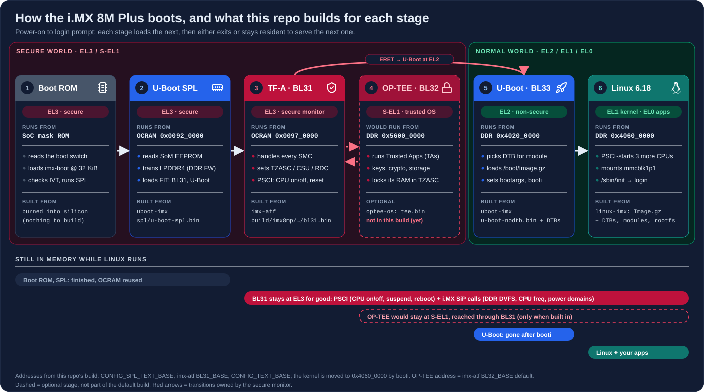

```bash
./build.sh deps --install          # once: host packages
./build.sh --accept-eula all       # boot firmware + kernel + rootfs → build/deploy/sdcard.img
./build.sh flash -d /dev/sdX       # write the card, boot the board
```

- **Latest Variscite release:** U-Boot 2026.04, TF-A 2.12, Linux 6.18 LTS, at
  the exact commits Variscite ships in its own Yocto BSP (`wrynose_6.18.20_2.0.0_var01`).
- **One image, every module:** DART-MX8M-PLUS, VAR-SOM-MX8M-PLUS and
  VAR-SMARC-MX8M-PLUS. U-Boot reads the module's EEPROM and picks the device tree.
- **Reproducible:** pinned commits, a pinned compiler, and a sha256 on every download.
- **Rootless:** compiling and image assembly run as your user. sudo is only
  needed for installing packages and writing the card.
- **Explains itself:** every command is printed with *why* it runs, and
  `--dry-run` turns the whole build into a readable recipe.
- **Verified on hardware:** VAR-SOM-MX8M-PLUS rev 1.2 on Symphony boots to a
  login prompt (real logs throughout the docs).

---

## Quick start

| Step | Command | What happens |
| --- | --- | --- |
| **1. Host setup** (once) | `git clone https://github.com/N3b3x/custom_var_imx8mp && cd custom_var_imx8mp`<br>`./build.sh deps --install` | installs ~30 Ubuntu/Debian packages. The cross-compiler is downloaded later, automatically |
| **2. Build** (~25 min first time) | `./build.sh --accept-eula all`<br>or `./build.sh --accept-eula -r alpine all` | Debian 13 rootfs (full distro), or Alpine (tiny, no sudo). Ends with `SD card image: build/deploy/…img` |
| **3. Flash** | `lsblk -dpo NAME,SIZE,TRAN,MODEL`<br>`./build.sh flash -d /dev/sdX --expand` | refuses system disks, shows the card, asks, writes, grows the partition to the whole card |
| **4. Boot** | boot switch → **SD**, then `picocom -b 115200 /dev/ttyUSB0` | serial console: `ttymxc0` on DART, `ttymxc1` on VAR-SOM/SMARC. A screen shows penguins, then a login |
| **5. Log in** | `root` / `variscite` | then read **[Using the board](docs/11-using-the-board.md)** and the **[Board tour](docs/12-board-tour.md)** |

`--accept-eula` accepts NXP's licence for the DDR firmware blobs. Re-running
the build is cheap: unchanged parts are skipped, and an unchanged
`./build.sh all` takes about 30 s.

---

## 1. The boot chain

The diagram at the top is the whole story. From power-on to `login:`, each
stage loads the next:

| # | Stage | Runs at | From | Its job | Built from |
| --- | --- | --- | --- | --- | --- |
| 1 | **Boot ROM** | EL3 · secure | mask ROM in the SoC | reads the boot switch, loads `imx-boot` from **32 KiB** on SD/eMMC | silicon |
| 2 | **U-Boot SPL** | EL3 · secure | OCRAM `0x0092_0000` | identifies the module, **trains the LPDDR4**, unpacks the FIT | `uboot-imx` |
| 3 | **TF-A BL31** | EL3 · secure monitor | OCRAM `0x0097_0000` | sets up TrustZone, PSCI, the world switch; **stays resident** | `imx-atf` |
| 4 | *OP-TEE BL32* | *S-EL1 · trusted OS* | *DDR `0x5600_0000`* | *trusted apps, keys. Optional, not in this build* | *imx-optee-os* |
| 5 | **U-Boot proper** (BL33) | EL2 · non-secure | DDR `0x4020_0000` | picks the DTB, loads `/boot/Image.gz`, `booti`, then exits | `uboot-imx` |
| 6 | **Linux 6.18** | EL2 → EL1 · non-secure | DDR `0x4060_0000` | starts CPUs 1–3 via BL31, mounts the SD card, runs `/sbin/init` | `linux-imx` + rootfs |

The first three stages travel together in **one file**, `imx-boot.bin`, which
the build writes at 32 KiB on the card. This is what's inside it, and who
copies each part where:

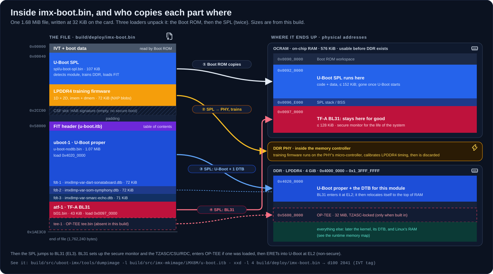

Then U-Boot's `bootcmd` finds the kernel and the right device tree, and
Linux brings up userspace:

| U-Boot: how it finds Linux | Linux: from kernel to `login:` |
| --- | --- |
| [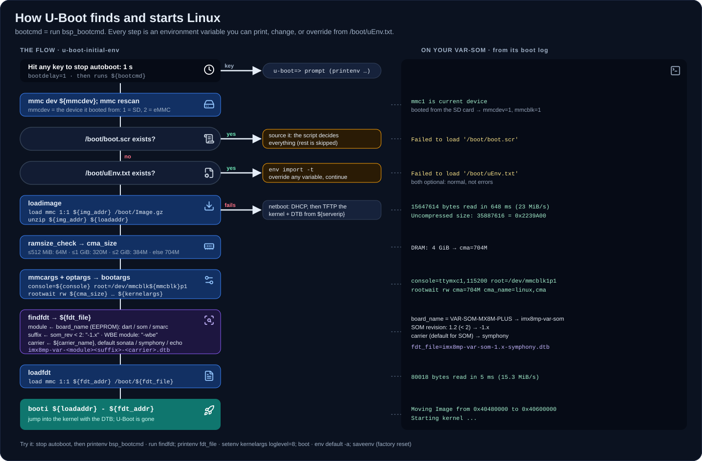](docs/images/uboot-bootcmd.svg) | [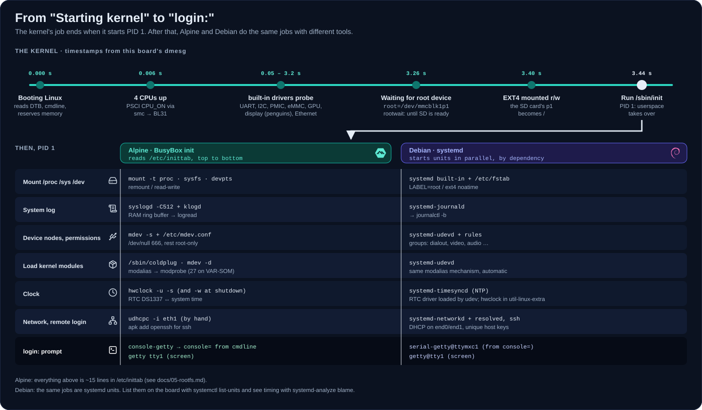](docs/images/linux-to-login.svg) |
| `bsp_bootcmd` → `uEnv.txt` → `Image.gz` → `findfdt` → `booti`, with this board's real values. [Read more](docs/03-uboot.md) | built-in drivers → root at 3.4 s → PID 1. Alpine's BusyBox and Debian's systemd do the same jobs. [Read more](docs/05-rootfs.md) |

Deep dive: **[01 · Boot flow](docs/01-boot-flow.md)**.

---

## 2. How the build makes the SD card

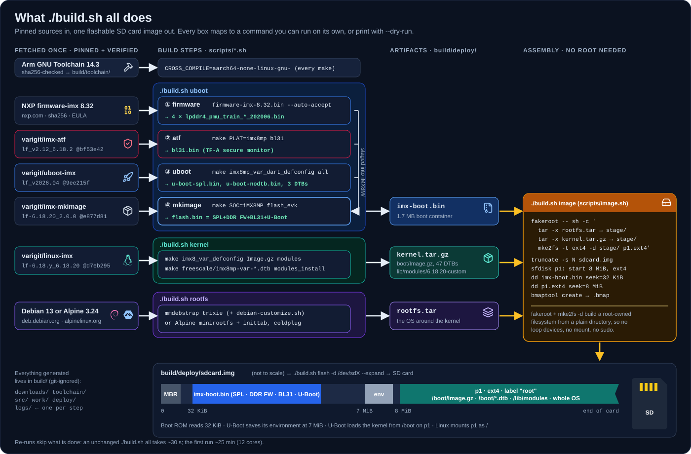

Why each step exists, in one line each:

| Step | Command (runs on its own too) | Produces | Why it's needed |
| --- | --- | --- | --- |
| toolchain | *(automatic)* | `aarch64-none-linux-gnu-gcc` 14.3 | your PC is x86-64; the board is ARM64 |
| firmware | `./build.sh uboot firmware` | 4 × `lpddr4_pmu_train_*.bin` | LPDDR4 must be trained at every power-up, with NXP's blobs |
| atf | `./build.sh uboot atf` | `bl31.bin` | the CPU starts in EL3; something must own EL3 and the secure world forever |
| uboot | `./build.sh uboot uboot` | `u-boot-spl.bin`, `u-boot-nodtb.bin`, DTBs | SPL fits in on-chip RAM before DDR works; U-Boot proper loads Linux |
| mkimage | `./build.sh uboot mkimage` | `imx-boot.bin` | the Boot ROM only understands NXP's container format (IVT + FIT) |
| kernel | `./build.sh kernel` | `Image.gz`, 47 DTBs, modules | the OS; one DTB per module/carrier/revision variant |
| rootfs | `./build.sh rootfs` | `rootfs.tar` | init, shell, libraries: everything in `/` |
| image | `./build.sh image` | `sdcard.img` + `.bmap` | lays out the card byte-exactly, **without root** (`fakeroot` + `mke2fs -d`) |
| flash | `./build.sh flash -d /dev/sdX` | the SD card | guarded `bmaptool`/`dd`, optional `--expand` |

The card's layout matches Variscite's Yocto images exactly: `imx-boot.bin` at **32 KiB**, U-Boot's environment at **7 MiB**, and one ext4 partition from **8 MiB** holding `/boot` and the whole OS (see the [storage map](docs/images/storage-map.svg)).

See every command with its explanation without building anything:
`./build.sh --dry-run all | less -R`. Deep dives:
[03 · U-Boot](docs/03-uboot.md) · [04 · Kernel](docs/04-kernel.md) ·
[05 · Rootfs](docs/05-rootfs.md) · [06 · SD card image](docs/06-sdcard-image.md).

---

## 3. The secure world in one page

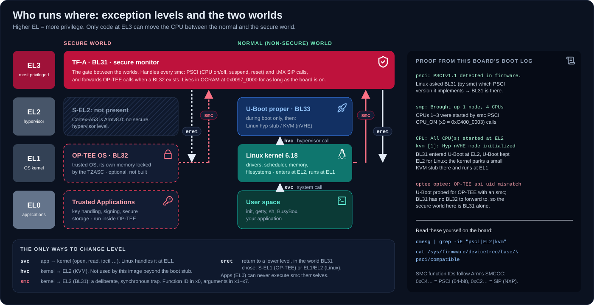

The names that confuse everyone:

| Name | What it actually is |
| --- | --- |
| **ATF** | the old name of **TF-A** (Trusted Firmware-A). "Loading ATF" on i.MX means loading `bl31.bin` |
| **BL31** | TF-A's runtime part: the **secure monitor** at EL3. The only code that can switch worlds. **Stays resident after Linux boots** |
| **BL32** | the *secure payload* slot, usually **OP-TEE**: a trusted OS at S-EL1 that runs Trusted Applications next to Linux. **Optional, and not part of this build** |
| **BL33** | the normal-world bootloader BL31 hands off to: **U-Boot proper**. Gone once Linux starts |
| **BL1 / BL2** | not used on i.MX: the Boot ROM plays BL1, and U-Boot SPL plays BL2 |

**The BL numbers are boot-stage names, not privilege levels.**

Key facts, each checked against this repo's sources:

- **The SPL loads everything; BL31 doesn't load OP-TEE.** The SPL copies BL31,
  U-Boot (and `tee.bin`, if present) out of the FIT. BL31 only *starts* OP-TEE
  through its dispatcher (`SPD=opteed`), then ERETs into U-Boot at EL2.
- **After boot, only BL31 (and OP-TEE, if built) remain.** Linux calls BL31
  with **`smc`**: PSCI to start CPUs 1–3 on every boot, to reboot and power
  off, and NXP SiP calls for DDR/CPU frequency.
- **Linux enters at EL2**, keeps a KVM stub there, and runs at EL1:
  `CPU: All CPU(s) started at EL2` in the boot log.
- **TrustZone is enforced by the bus (TZASC/CSU), not by Linux.** In this
  build the TZASC is on, but region 0 lets both worlds use all of DDR.
  **Nothing is secret yet.** OP-TEE plus HAB secure boot is what turns it into
  protected key storage.

<table><tr>
<td width="50%"><a href="docs/images/smc-flow.svg">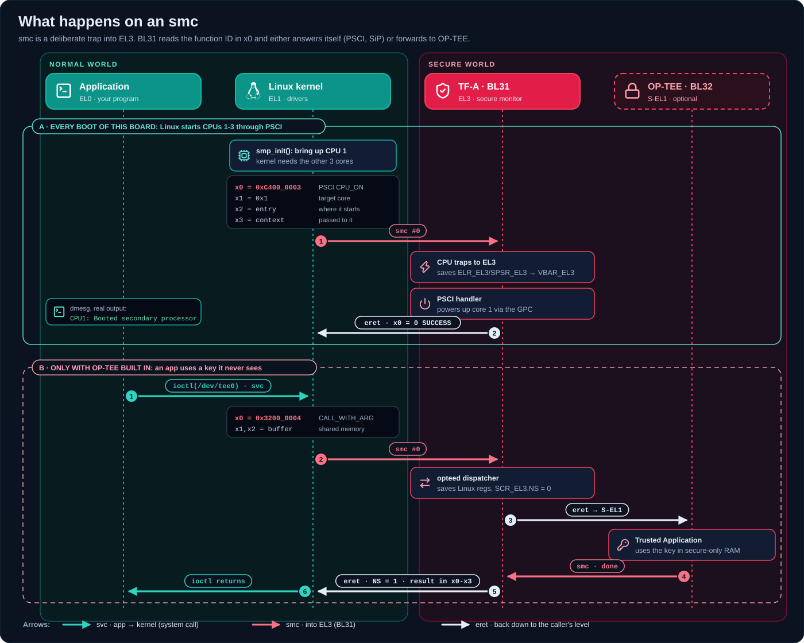</a><br><b>What an <code>smc</code> does</b>: PSCI CPU_ON on every boot, and an OP-TEE call</td>
<td width="50%"><a href="docs/images/trustzone.svg">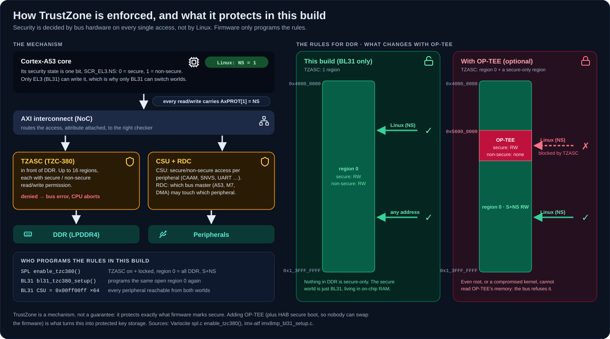</a><br><b>How TrustZone is enforced</b>, and what this build protects vs. with OP-TEE</td>
</tr></table>

Deep dive with the full SMC function-ID table and the OP-TEE roadmap:
**[13 · Secure world](docs/13-secure-world.md)**.

---

## Everyday workflows

| I want to... | Run |
| --- | --- |
| build everything | `./build.sh all` |
| rebuild after changing a driver or device tree | `./build.sh kernel` → `./build.sh flash -d /dev/sdX --kernel-only` |
| rebuild after changing U-Boot | `./build.sh uboot` → `./build.sh flash -d /dev/sdX --bootloader-only` |
| add my carrier board's device tree | drop `my-board.dts` in `custom/dts/` → `./build.sh kernel` ([guide](docs/08-customizing.md)) |
| change a kernel option | `./build.sh kernel-menuconfig`, or a fragment in `config/kernel/` ([guide](docs/04-kernel.md#configuration-changes)) |
| carry a source change | `git format-patch` into `patches/<component>/` ([guide](docs/08-customizing.md#patches)) |
| change password / hostname / packages | `config/local.conf` → `./build.sh rootfs && ./build.sh image` |
| see versions and commits | `./build.sh info` |
| read how something is built | `./build.sh --dry-run uboot \| less -R` |
| start from scratch | `./build.sh distclean` |

## Command reference

| Command | Does |
| --- | --- |
| `all` | `uboot` + `kernel` + `rootfs` + `image` (reuses an existing rootfs) |
| `uboot [firmware\|atf\|uboot\|mkimage]` | boot container, all four stages or one |
| `kernel [config\|build\|install]` | kernel, DTBs, modules |
| `rootfs` · `image` | root filesystem · SD card image |
| `flash -d DEV [--expand] [--bootloader-only\|--kernel-only]` | write to an SD card (sudo) |
| `deps [--install]` · `info` | host packages · versions |
| `uboot-menuconfig` · `kernel-menuconfig` | interactive configuration |
| `clean` · `distclean` | remove outputs · remove all of `build/` |

| Option | Meaning |
| --- | --- |
| `-n`, `--dry-run` | **explain mode**: print every command with its reason, run nothing |
| `-r`, `--rootfs X` | `debian` (default) · `alpine` · `/path/to/rootfs.tar.*` |
| `-u`, `--update` | re-sync git sources to the pinned commits |
| `-j N` · `-v` · `-y` | parallel jobs · full compiler lines · no prompts |
| `--accept-eula` | accept the NXP firmware EULA |

Every setting lives in [`config/imx8mp-var-dart.conf`](config/imx8mp-var-dart.conf).
Override it in `config/local.conf` (git-ignored) or for one run:
`KERNEL_LOCALVERSION=-test ./build.sh kernel`.

### Explain mode

```text
$ ./build.sh --dry-run uboot
==== Step 2/4: ARM Trusted Firmware (TF-A) lf_v2.12_6.18.2-1.0.0_var01 ====
  BL31 stays resident in on-chip RAM after boot. Linux calls into it
  (PSCI) to start the secondary Cortex-A53 cores, reboot and suspend.
  # Build BL31 for imx8mp
  $ make -C $B/src/imx-atf -j12 CROSS_COMPILE=aarch64-none-linux-gnu- PLAT=imx8mp IMX_BOOT_UART_BASE=auto E=0 bl31
```

Every step logs to `build/logs/`. On failure the build prints the failing
command, where it was called from, and the log path.

---

## Learn the concepts

The diagrams above cover the boot. These explain the pieces around it. Click
any of them for full size.

| | | |
| --- | --- | --- |
| [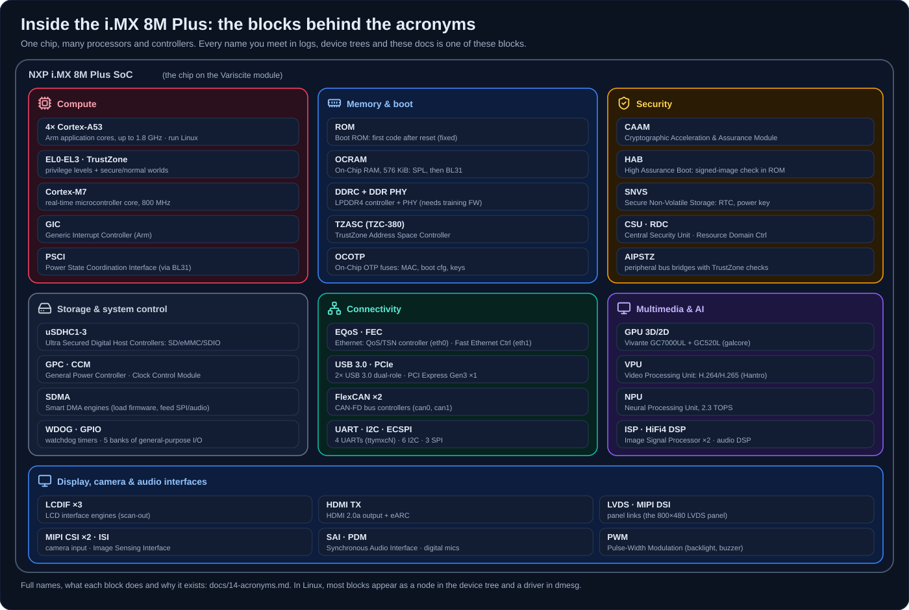](docs/images/soc-map.svg)<br>**[The chip, block by block](docs/14-acronyms.md)**: every acronym on the SoC | [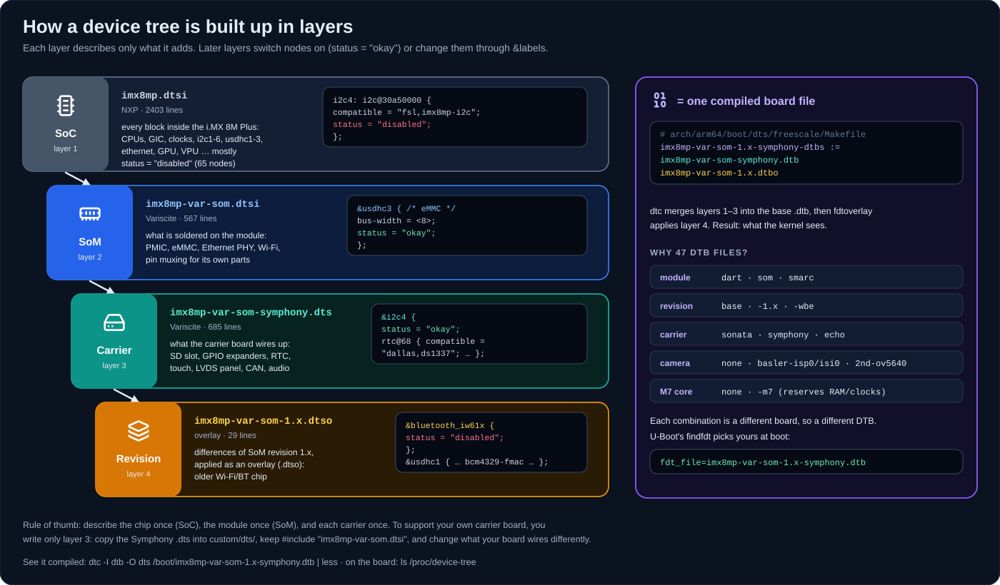](docs/images/dt-layers.svg)<br>**[Device tree layers](docs/04-kernel.md#device-trees)**: SoC → SoM → carrier → revision | [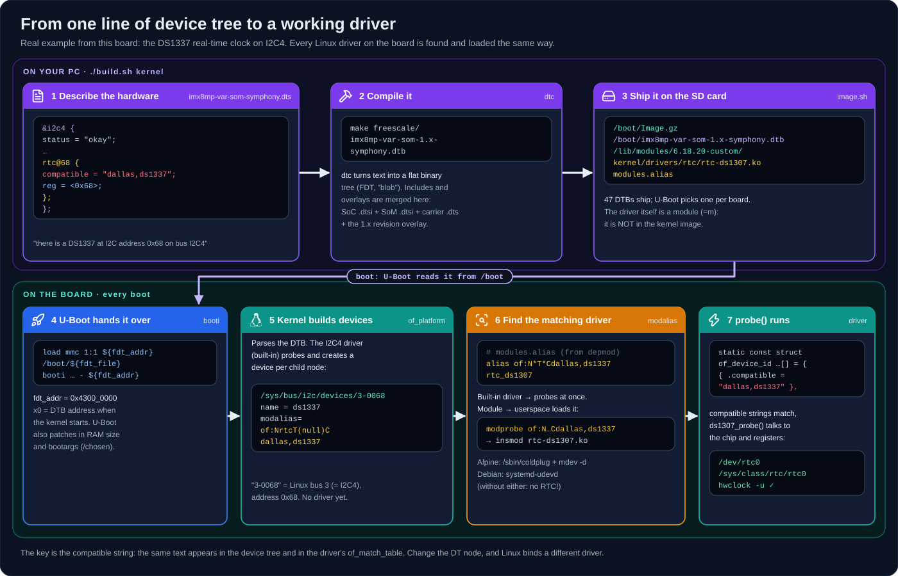](docs/images/dt-to-driver.svg)<br>**[DT node → driver](docs/04-kernel.md#your-own-device-tree)**: how Linux binds hardware |
| [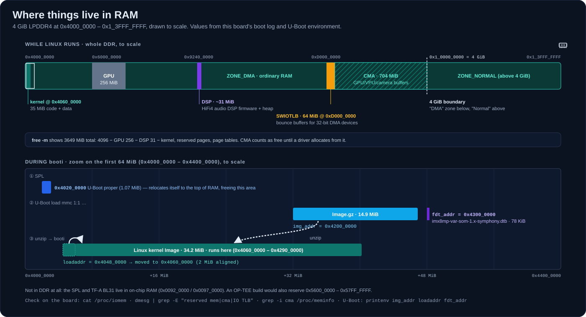](docs/images/memory-map.svg)<br>**[Memory map](docs/01-boot-flow.md#4-where-things-live-in-ram)**: 4 GiB DDR, the booti zoom | [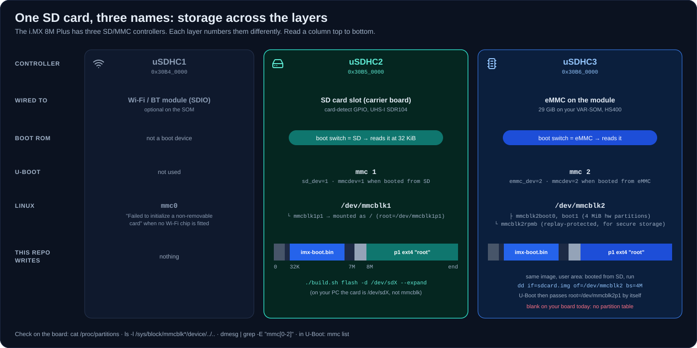](docs/images/storage-map.svg)<br>**[Storage names](docs/01-boot-flow.md#5-storage-the-sd-card-and-the-names)**: uSDHC ↔ mmc ↔ mmcblk | [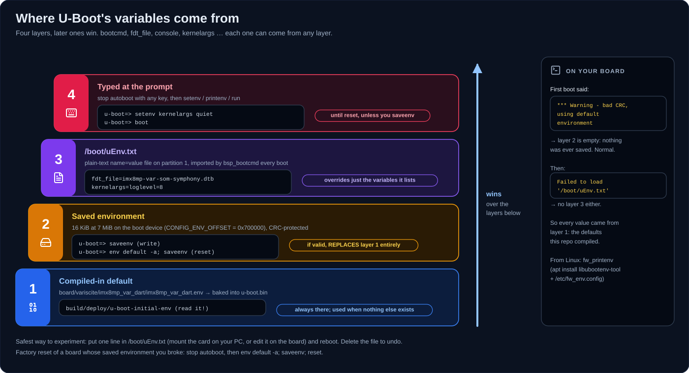](docs/images/uboot-env.svg)<br>**[U-Boot variables](docs/03-uboot.md#where-the-variables-come-from)**: the 4 layers |
| [](docs/images/linux-fs.svg)<br>**[/proc, /sys, /dev](docs/11-using-the-board.md#3-find-every-command-and-what-it-does)**: the live kernel views | [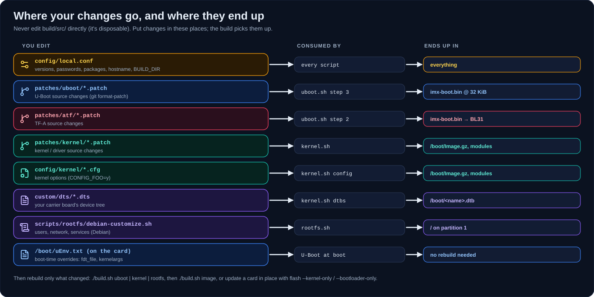](docs/images/customize-map.svg)<br>**[Where your changes go](docs/08-customizing.md)** | [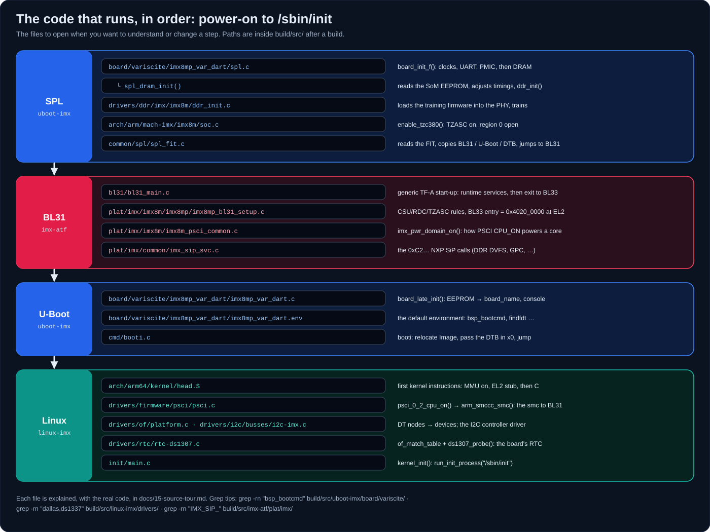](docs/images/source-map.svg)<br>**[The code, in order](docs/15-source-tour.md)**: files that run at boot |

## Documentation

| Start here | Understand it | Make it yours |
| --- | --- | --- |
| [02 · Host setup](docs/02-host-setup.md) | [01 · Boot flow](docs/01-boot-flow.md) | [08 · Customizing](docs/08-customizing.md) |
| [07 · Flashing & first boot](docs/07-flashing-and-boot.md) | [13 · Secure world](docs/13-secure-world.md) | [10 · Versions](docs/10-versions.md) |
| [11 · Using the board](docs/11-using-the-board.md) | [03 · U-Boot](docs/03-uboot.md) · [04 · Kernel](docs/04-kernel.md) | [09 · Troubleshooting](docs/09-troubleshooting.md) |
| [12 · Board tour](docs/12-board-tour.md) | [05 · Rootfs](docs/05-rootfs.md) · [06 · SD image](docs/06-sdcard-image.md) | [Docs index](docs/README.md) |
| [14 · Acronyms](docs/14-acronyms.md) | [15 · Source tour](docs/15-source-tour.md) | |

## Supported hardware

| Module | Carrier | Console | Status |
| --- | --- | --- | --- |
| **VAR-SOM-MX8M-PLUS** | Symphony | `ttymxc1` | ✅ boots to login on real hardware (rev 1.2) |
| **DART-MX8M-PLUS** | Sonata (formerly DT8MCustomBoard) | `ttymxc0` | built and image-verified |
| **VAR-SMARC-MX8M-PLUS** | Echo | `ttymxc1` | built and image-verified |

**Your PC:** Linux (built and verified on Ubuntu 22.04; Ubuntu 24.04 and Debian
12/13 are expected to work), x86-64 or ARM64, ~15 GB free disk, 8 GB+ RAM,
internet access.

## Versions

| Component | Version | Source |
| --- | --- | --- |
| U-Boot | 2026.04 | `varigit/uboot-imx` · `lf_v2026.04_6.18.20-2.0.0_var01` |
| TF-A | 2.12 | `varigit/imx-atf` · `lf_v2.12_6.18.2-1.0.0_var01` |
| imx-mkimage | LF 6.18.20 | `varigit/imx-mkimage` · `lf-6.18.20_2.0.0_var01` |
| NXP firmware | 8.32 | `firmware-imx-8.32-1991416.bin` (sha256 verified) |
| Linux | 6.18.20 LTS | `varigit/linux-imx` · `lf-6.18.y_6.18.20-2.0.0_var01` |
| Compiler | GCC 14.3 | Arm GNU Toolchain 14.3.rel1 (sha256 verified) |
| Root filesystem | Debian 13 · Alpine 3.24 | deb.debian.org · alpinelinux.org |

Older LTS sets (6.12, 6.6) and how to find new releases: [10 · Versions](docs/10-versions.md).

## Repository layout

```text
build.sh                         ← the only command you need
config/imx8mp-var-dart.conf      every version, URL and setting (commented)
config/local.conf                your overrides (create it; git-ignored)
config/kernel/*.cfg              kernel config fragments
scripts/lib/common.sh            logging, explain mode, git, downloads, toolchain
scripts/{uboot,kernel,rootfs,image,flash}.sh   one script per step
scripts/rootfs/debian-customize.sh             users, network, ssh for Debian
custom/dts/                      your own device trees
patches/<component>/             your source patches
docs/                            the manual · docs/images/ the diagrams (+ _src/ generators)
build/                           everything generated (git-ignored)
```

## FAQ

<details><summary><b>The screen only shows penguins. Is it stuck?</b></summary>

No. The penguins are the kernel's boot logo, one per CPU core. Boot messages go
to the serial console, and the screen shows `login:` once userspace is up.
</details>

<details><summary><b>Boot ends at "Run /sbin/init" and no login appears</b></summary>

The login is on a different serial port than the one you're watching.
Current images follow U-Boot's `console=` automatically. Older ones need
`./build.sh -r alpine rootfs && ./build.sh image` and a reflash.
</details>

<details><summary><b>Is OP-TEE included? Is my data protected?</b></summary>

No, and no. This build has TF-A BL31 as the only secure-world component, and
DDR is open to both worlds. See [13 · Secure world](docs/13-secure-world.md)
for what OP-TEE and HAB secure boot add, and the roadmap to enable them.
</details>

<details><summary><b>Debian or Alpine?</b></summary>

**Debian** (default) is a full distribution: `apt`, systemd, ssh, automatic
networking. **Alpine** is ~10 MB and builds without sudo, which is great for
bring-up and kernel work. [05 · Rootfs](docs/05-rootfs.md).
</details>

<details><summary><b>How do I see what's running on the board?</b></summary>

`ps`, `top`, `pstree`, `free -m`, `df -h`, `dmesg`, `logread -f`. The full,
explained list is in [11 · Using the board](docs/11-using-the-board.md).
</details>

<details><summary><b>Something failed. Where do I look?</b></summary>

The error names the failing command and the log in `build/logs/`. Most problems
are covered in [09 · Troubleshooting](docs/09-troubleshooting.md).
</details>

<details><summary><b>Migrating from the old <code>uboot-imx/</code> and <code>linux-imx/</code> scripts</b></summary>

| Old | New |
| --- | --- |
| `uboot-imx/uboot_imx_build.sh -w DIR -b all` | `./build.sh uboot` |
| `uboot-imx/uboot_imx_build.sh -b flash -d /dev/sdX` | `./build.sh flash --bootloader-only -d /dev/sdX` |
| `linux-imx/linux_imx_build.sh -w DIR` | `./build.sh kernel` |
| `linux-imx/linux_imx_build.sh -f /dev/sdX` | `./build.sh flash --kernel-only -d /dev/sdX` |
| `*_env.sh` | `config/imx8mp-var-dart.conf` + `config/local.conf` |

The old scripts couldn't produce a bootable card. The kernel landed on a FAT
partition where U-Boot never looks, `mkimage_imx8` was never built, the DDR
firmware was outdated, `ccache` inside `CROSS_COMPILE` broke TF-A, the kernel
defconfig was wrong, and the carrier DTB had been renamed upstream.
</details>

## Credits & license

Scripts and documentation in this repository are free to use. Downloaded
components keep their own licenses: U-Boot and Linux are GPL-2.0, TF-A is
BSD-3-Clause, and NXP firmware-imx is under the
[NXP EULA](https://www.nxp.com/docs/en/disclaimer/LA_OPT_NXP_SW.html).
Diagram icons: [Lucide](https://lucide.dev) (ISC) and
[Simple Icons](https://simpleicons.org) (CC0), embedded inline. See
[docs/images/README.md](docs/images/README.md).
