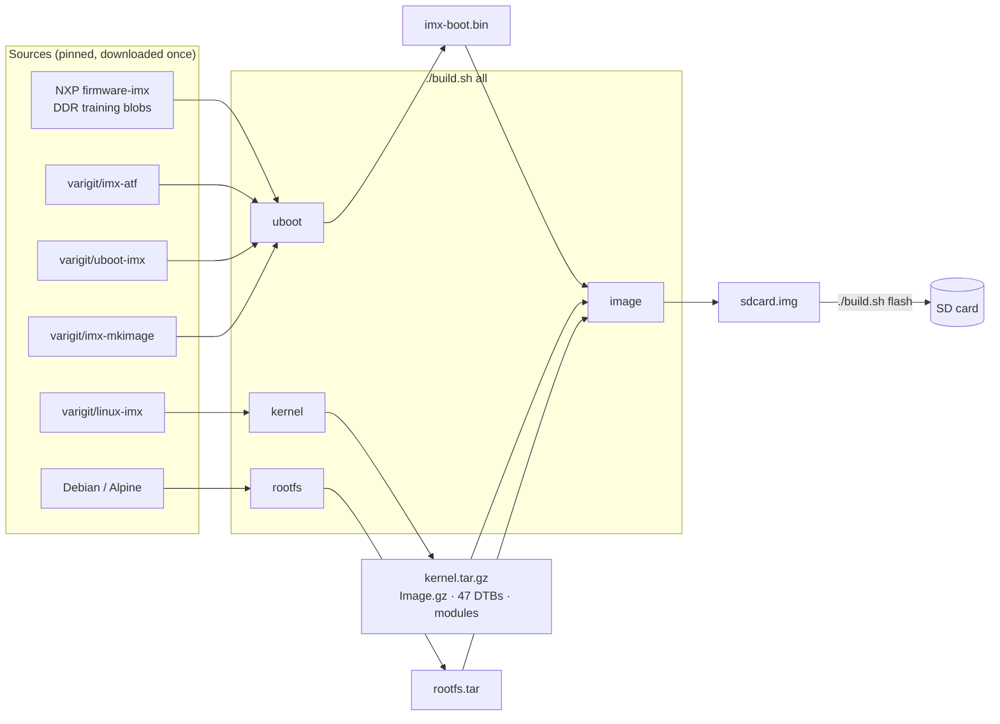

# i.MX 8M Plus · Variscite BSP builder

**Build the bootloader, the Linux kernel and a ready-to-flash SD card image
for Variscite i.MX 8M Plus modules from source, with one command and no Yocto.**

```bash
./build.sh deps --install          # once: install host packages
./build.sh --accept-eula all       # build everything → build/deploy/sdcard.img
./build.sh flash -d /dev/sdX       # write it to an SD card
```

- **Latest Variscite release:** U-Boot 2026.04, TF-A 2.12, Linux 6.18 LTS, at
  the exact commits Variscite ships in its Yocto BSP.
- **One image, every module:** DART-MX8M-PLUS, VAR-SOM-MX8M-PLUS and
  VAR-SMARC-MX8M-PLUS are detected at boot.
- **Reproducible:** pinned sources, a pinned compiler, and checksums on every
  download.
- **Rootless build:** sudo only for installing packages and writing the card.
- **Explains itself:** every command the build runs is printed with a comment
  saying *why*, and `--dry-run` turns the build into a readable recipe.
- **Verified on hardware:** VAR-SOM-MX8M-PLUS rev 1.2 on Symphony boots to a
  login prompt.

---

## Contents

1. [Supported hardware](#supported-hardware)
2. [Quick start](#quick-start): from zero to a login prompt
3. [How it works](#how-it-works)
4. [Everyday workflows](#everyday-workflows)
5. [Command reference](#command-reference)
6. [Explain mode](#explain-mode)
7. [Documentation](#documentation): the full manual
8. [Versions](#versions)
9. [Repository layout](#repository-layout)
10. [FAQ](#faq)
11. [Migrating from the old scripts](#migrating-from-the-old-scripts)

---

## Supported hardware

| Module | Carrier board | Serial console | Status |
| --- | --- | --- | --- |
| **VAR-SOM-MX8M-PLUS** | Symphony | `ttymxc1` (UART2) | ✅ booted on real hardware (rev 1.2) |
| **DART-MX8M-PLUS** | Sonata (formerly DT8MCustomBoard) | `ttymxc0` (UART1) | built and image-verified |
| **VAR-SMARC-MX8M-PLUS** | Echo | `ttymxc1` (UART2) | built and image-verified |

The same SD card works on all three: the bootloader reads the module's
EEPROM and picks the matching device tree and console automatically.

**Your PC:** Linux, ideally Ubuntu 22.04/24.04 or Debian 12/13 (x86-64 or
ARM64), with ~15 GB free disk, 8 GB+ RAM, and internet access.

---

## Quick start

### Step 1: Get the code and the host packages (once)

```bash
git clone <this-repo-url> custom_var_imx8mp
cd custom_var_imx8mp
./build.sh deps --install
```

`deps` checks ~30 Debian/Ubuntu packages (compilers, `mkfs` tools, qemu for
the Debian rootfs...) and installs the missing ones with `sudo apt`. The cross
compiler itself is downloaded automatically later; you don't install it.

### Step 2: Build everything (~30 min the first time)

```bash
./build.sh --accept-eula all              # Debian 13 root filesystem (full distro)
# or
./build.sh --accept-eula -r alpine all    # Alpine: tiny, builds without sudo
```

`--accept-eula` accepts NXP's license for the DDR firmware blobs. Without it
you're asked interactively. The build runs four stages and ends with:

```text
==== Done ====
  Device                       Boot Start     End Sectors  Size Id Type
  ...imx8mp-var-dart-...img1   *    16384 1343487 1327104  648M 83 Linux
[19:17:24] SD card image: build/deploy/imx8mp-var-dart-alpine-3.24.2-...img (71M on disk, 656M apparent)
[19:17:24] Everything built in 26 min 3 s
```

Re-running is cheap: unchanged parts are skipped, and an unchanged
`./build.sh all` takes ~30 seconds.

### Step 3: Write the SD card

Insert a card (≥ 2 GB), find its device name, then flash:

```bash
lsblk -dpo NAME,SIZE,TRAN,MODEL          # e.g. /dev/sdb  29.7G  usb  STORAGE DEVICE
./build.sh flash -d /dev/sdb --expand    # --expand grows the root partition to the whole card
```

`flash` refuses your system disk and partitions, shows the card's model and
size, and asks before writing.

### Step 4: Boot

1. Put the card in the board and set the carrier's **boot switch to SD**.
2. Connect the debug USB/UART to your PC and open the console:
   `picocom -b 115200 /dev/ttyUSB0`
3. Power on. U-Boot, then Linux boot messages scroll by. A monitor shows
   **penguins** during boot (one per CPU core), and then a login.

### Step 5: Log in and explore

```text
imx8mp-var-dart login: root
Password: variscite
imx8mp-var-dart:~# uname -r
6.18.20-custom
```

| User | Password | Notes |
| --- | --- | --- |
| `root` | `variscite` | change it with `passwd`, or set `TARGET_PASSWORD` before building |
| `var` | `variscite` | Debian image only, has `sudo` |

Next stop: **[docs/11-using-the-board.md](docs/11-using-the-board.md)**, which
covers networking, processes, logs, hardware discovery, and every command on
the board with a one-line explanation. Then
**[docs/12-board-tour.md](docs/12-board-tour.md)** shows real output from a
live board, so you know what "normal" looks like.

---

## How it works



On the card, the layout matches Variscite's own Yocto images:

```text
 0      32 KiB                  7 MiB      8 MiB                              end
 ├─MBR──┼── imx-boot.bin ───────┼─U-Boot env┼── p1: ext4 "root" ─────────────────┤
          SPL + DDR FW + TF-A               /boot/Image.gz, /boot/*.dtb,
          + U-Boot (read by the             /lib/modules, the whole OS
          i.MX8MP Boot ROM)
```

At power-on: **Boot ROM → U-Boot SPL** (trains the LPDDR4) **→ TF-A → U-Boot**
(detects module, picks DTB) **→ Linux** (mounts p1) **→ init → login**.
[docs/01-boot-flow.md](docs/01-boot-flow.md) explains each hop.

| Output in `build/deploy/` | What it is |
| --- | --- |
| `sdcard.img` + `.bmap` | **the flashable image** |
| `imx-boot.bin` | the boot container alone (for `--bootloader-only` updates) |
| `kernel/`, `kernel.tar.gz` | `Image.gz`, all DTBs, modules (for `--kernel-only` updates) |
| `rootfs.tar` | the root filesystem |
| `u-boot-initial-env` | U-Boot's default environment as text: how it finds and boots the kernel |

---

## Everyday workflows

| I want to... | Run |
| --- | --- |
| build everything | `./build.sh all` |
| rebuild after changing a driver or device tree | `./build.sh kernel` → `./build.sh flash -d /dev/sdX --kernel-only` |
| rebuild after changing U-Boot | `./build.sh uboot` → `./build.sh flash -d /dev/sdX --bootloader-only` |
| add my own carrier-board device tree | drop `my-board.dts` in `custom/dts/` → `./build.sh kernel` ([guide](docs/08-customizing.md)) |
| change a kernel option | `./build.sh kernel-menuconfig`, or a fragment in `config/kernel/` ([guide](docs/04-kernel.md#configuration-changes)) |
| carry a source change | `git format-patch` into `patches/<component>/` ([guide](docs/08-customizing.md#patches)) |
| change password / hostname / packages | `config/local.conf` → `./build.sh rootfs && ./build.sh image` |
| see what will be built | `./build.sh info` |
| read how something is built | `./build.sh --dry-run uboot \| less -R` |
| start from scratch | `./build.sh distclean` |

---

## Command reference

```text
./build.sh [options] <command> [args]
```

| Command | Does |
| --- | --- |
| `all` | `uboot` + `kernel` + `rootfs` + `image` (reuses an existing rootfs) |
| `uboot [firmware\|atf\|uboot\|mkimage]` | boot container, all four stages or one |
| `kernel [config\|build\|install]` | kernel, DTBs, modules, all or one stage |
| `rootfs` | (re)build the root filesystem |
| `image` | (re)assemble `sdcard.img` |
| `flash -d DEV [--expand] [--bootloader-only\|--kernel-only] [--force]` | write to an SD card (sudo) |
| `deps [--install]` | check / install host packages |
| `info` | print every version, branch and commit that will be built |
| `uboot-menuconfig`, `kernel-menuconfig` | interactive configuration |
| `clean` / `distclean` | remove outputs (keep downloads) / remove all of `build/` |

| Option | Meaning |
| --- | --- |
| `-n`, `--dry-run` | **explain mode**: print every command with its reason, run nothing |
| `-r`, `--rootfs X` | `debian` (default) · `alpine` · `/path/to/rootfs.tar.*` |
| `-u`, `--update` | re-sync git sources to the pinned commits |
| `-j N` | parallel jobs (default: all cores) |
| `-v`, `--verbose` | full compiler command lines |
| `--accept-eula` | accept the NXP firmware EULA |
| `-y`, `--yes` | no confirmation prompts |

All settings (versions, users, packages, image layout) live in
[`config/imx8mp-var-dart.conf`](config/imx8mp-var-dart.conf). Override any of
them in `config/local.conf` (git-ignored) or for one run on the command line:
`KERNEL_LOCALVERSION=-test ./build.sh kernel`.

---

## Explain mode

The scripts double as documentation. Each command is printed with a comment
saying why it exists, and `--dry-run` prints the whole sequence without
running anything:

```text
$ ./build.sh --dry-run uboot
==== Step 2/4: ARM Trusted Firmware (TF-A) lf_v2.12_6.18.2-1.0.0_var01 ====
  BL31 stays resident in on-chip RAM after boot. Linux calls into it
  (PSCI) to start the secondary Cortex-A53 cores, reboot and suspend.
  # Build BL31 for imx8mp
  $ make -C $B/src/imx-atf -j12 CROSS_COMPILE=aarch64-none-linux-gnu- PLAT=imx8mp IMX_BOOT_UART_BASE=auto E=0 bl31
```

Every step also writes a full log to `build/logs/`. On failure the build
prints the failing command, where it was called from, and the log path.

---

## Documentation

Read in order for the full picture, or jump to what you need.

### Getting started

| | Guide | You'll learn |
| --- | --- | --- |
| 02 | [Host setup](docs/02-host-setup.md) | what to install and why, the toolchain, the NXP EULA, `local.conf` |
| 07 | [Flashing & first boot](docs/07-flashing-and-boot.md) | writing the card, boot switch, serial console, what a good boot looks like |
| 11 | [Using the board](docs/11-using-the-board.md) | **exploring the running system**: processes, logs, hardware, network, every command explained |
| 12 | [Board tour](docs/12-board-tour.md) | **real output from a live board**, explained: what's normal, what isn't, and why |

### Understanding the system

| | Guide | You'll learn |
| --- | --- | --- |
| 01 | [Boot flow](docs/01-boot-flow.md) | Boot ROM → SPL → DDR training → TF-A → U-Boot → Linux, and the card's memory map |
| 03 | [U-Boot](docs/03-uboot.md) | the boot container built by hand, command by command; the U-Boot environment |
| 04 | [Kernel](docs/04-kernel.md) | kernel build, the 47 device trees and their naming, config fragments |
| 05 | [Root filesystem](docs/05-rootfs.md) | Debian vs Alpine vs your own; users, network, ssh |
| 06 | [SD card image](docs/06-sdcard-image.md) | building a disk image without root; inspecting it |

### Making it yours

| | Guide | You'll learn |
| --- | --- | --- |
| 08 | [Customizing](docs/08-customizing.md) | your carrier board's device tree, patches, settings, image layout |
| 10 | [Versions](docs/10-versions.md) | where every version comes from, switching to 6.12 / 6.6, upgrading |
| 09 | [Troubleshooting](docs/09-troubleshooting.md) | build errors and boot problems, symptom → fix |

---

## Versions

Taken from Variscite's Yocto layer
[`meta-variscite-bsp-imx` @ `wrynose_6.18.20_2.0.0_var01`](https://github.com/varigit/meta-variscite-bsp-imx/tree/wrynose_6.18.20_2.0.0_var01)
(October 2026) and pinned to exact commits:

| Component | Version | Source |
| --- | --- | --- |
| U-Boot | 2026.04 | `varigit/uboot-imx` · `lf_v2026.04_6.18.20-2.0.0_var01` |
| TF-A | 2.12 | `varigit/imx-atf` · `lf_v2.12_6.18.2-1.0.0_var01` |
| imx-mkimage | LF 6.18.20 | `varigit/imx-mkimage` · `lf-6.18.20_2.0.0_var01` |
| NXP firmware | 8.32 | `firmware-imx-8.32-1991416.bin` (sha256 verified) |
| Linux | 6.18.20 LTS | `varigit/linux-imx` · `lf-6.18.y_6.18.20-2.0.0_var01` |
| Compiler | GCC 14.3 | Arm GNU Toolchain 14.3.rel1 (sha256 verified) |
| Root filesystem | Debian 13 · Alpine 3.24 | deb.debian.org · alpinelinux.org |

Ready-made settings for the older 6.12 and 6.6 releases, and how to spot new
ones: [docs/10-versions.md](docs/10-versions.md).

---

## Repository layout

```text
build.sh                       ← the only command you need
config/
├── imx8mp-var-dart.conf       every version, URL and setting (commented)
├── local.conf                 your overrides (create it; git-ignored)
└── kernel/*.cfg               kernel config fragments
scripts/
├── lib/common.sh              logging, explain mode, git, downloads, toolchain
├── uboot.sh                   firmware → TF-A → U-Boot → imx-mkimage
├── kernel.sh                  defconfig → Image.gz + modules + DTBs
├── rootfs.sh                  Debian / Alpine / your tarball
├── rootfs/debian-customize.sh users, network, ssh for the Debian image
├── image.sh                   rootless SD image assembly
└── flash.sh                   safe card writing
custom/dts/                    your own device trees
patches/<component>/           your source patches
docs/                          the manual
build/                         everything generated (git-ignored)
```

---

## FAQ

<details>
<summary><b>The screen only shows penguins. Is it stuck?</b></summary>

No. The penguins are the kernel's boot logo, one per CPU core. Boot messages go
to the **serial console**, and the screen shows a login once the system is up.
Check the serial console: `ttymxc0` on DART, `ttymxc1` on VAR-SOM/SMARC.
</details>

<details>
<summary><b>Boot ends at "Run /sbin/init as init process" and no login appears</b></summary>

The system is running, but the login is on a different serial port than the one
you're watching. Current images start the login on whatever console U-Boot
chose. If your image is older, rebuild with
`./build.sh -r alpine rootfs && ./build.sh image` and reflash.
</details>

<details>
<summary><b>Debian or Alpine?</b></summary>

**Debian** (default) is a full distribution: `apt`, systemd, ssh, and automatic
networking. **Alpine** is ~10 MB and builds without sudo, which makes it
perfect for bring-up and kernel work. See [docs/05-rootfs.md](docs/05-rootfs.md).
</details>

<details>
<summary><b>Do I need root / sudo?</b></summary>

Only to install host packages (once), to build the Debian rootfs (unless
`uidmap` enables rootless mode), and to write the SD card. Compiling and
assembling the image run as your normal user.
</details>

<details>
<summary><b>Which serial port / settings?</b></summary>

115200 baud, 8N1, no flow control. On the PC it's usually `/dev/ttyUSB0`:
`picocom -b 115200 /dev/ttyUSB0`. Add yourself to the `dialout` group once:
`sudo usermod -aG dialout $USER`.
</details>

<details>
<summary><b>How do I see what's running on the board?</b></summary>

`ps`, `top`, `pstree`, `free -m`, `df -h`, `dmesg`, `logread -f`. The full,
explained list is in [docs/11-using-the-board.md](docs/11-using-the-board.md).
</details>

<details>
<summary><b>Something failed. Where do I look?</b></summary>

The error message names the failing command and the log file in
`build/logs/`. Most problems are covered in
[docs/09-troubleshooting.md](docs/09-troubleshooting.md).
</details>

---

## Migrating from the old scripts

<details>
<summary>The previous <code>uboot-imx/</code> and <code>linux-imx/</code> scripts are replaced by <code>build.sh</code>. What maps to what, and what was fixed.</summary>

| Old | New |
| --- | --- |
| `uboot-imx/uboot_imx_build.sh -w DIR -b all` | `./build.sh uboot` |
| `uboot-imx/uboot_imx_build.sh -b flash -d /dev/sdX` | `./build.sh flash --bootloader-only -d /dev/sdX` |
| `linux-imx/linux_imx_build.sh -w DIR` | `./build.sh kernel` |
| `linux-imx/linux_imx_build.sh -f /dev/sdX` | `./build.sh flash --kernel-only -d /dev/sdX` |
| `-c` / `clean:all` | `./build.sh clean` / `distclean` |
| `*_env.sh` | `config/imx8mp-var-dart.conf` + `config/local.conf` |

What was broken before:

1. **No bootable card.** The kernel went onto a FAT `BOOT` partition, but
   Variscite's U-Boot loads `/boot/Image.gz` from ext4 partition 1.
2. **The `prep` target used undefined variables**, so it cloned an empty URL.
3. **`mkimage_imx8` was never built.** The old flow ran `soc.mak` out of tree
   with a tool that didn't exist, plus patches that didn't apply.
4. **Outdated DDR firmware** (8.18), and every Synopsys blob was copied instead
   of the four the i.MX8MP needs.
5. **`CROSS_COMPILE="ccache …"`** broke TF-A's toolchain detection.
6. **Wrong kernel defconfig** (`imx_v8_defconfig` instead of Variscite's
   `imx8_var_defconfig`).
7. **Wrong custom DTS path** (missing `freescale/`).
8. **Stale board names** (`dt8mcustomboard` was renamed `sonata`).
9. **Fragile scripts.** Logs went to whatever directory you were in, there was
   no `pipefail`, and dry-run still asked questions.

</details>

---

## License

The scripts and documentation in this repository are free to use. Downloaded
components keep their own licenses: U-Boot and Linux are GPL-2.0, TF-A is
BSD-3-Clause, and NXP firmware-imx is under the
[NXP Software License Agreement](https://www.nxp.com/docs/en/disclaimer/LA_OPT_NXP_SW.html).
