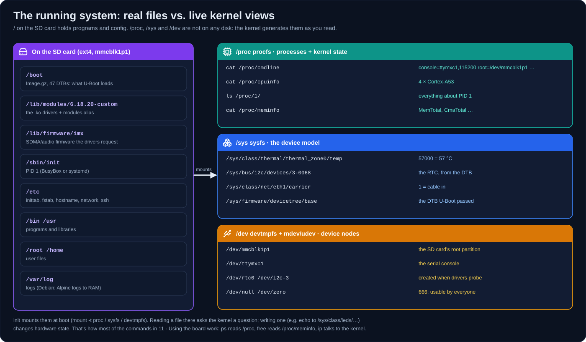

# 11 · Using the board: exploring your embedded Linux

[Docs](README.md) › **11 · Using the board**

> **You are here:** the card is flashed, the board booted, and you have a
> `login:` prompt. This guide shows what to type next: how to see what's
> running, what hardware Linux found, and how to get around.

**Contents:** [Log in](#1-log-in) · [Get online](#2-get-online) ·
[Find commands](#3-find-every-command-and-what-it-does) ·
[Processes](#4-processes-whats-running) · [System & resources](#5-system-cpu-memory-temperature) ·
[Storage](#6-storage-and-filesystems) · [Logs](#7-logs-what-happened) ·
[Kernel & drivers](#8-kernel-drivers-and-the-device-tree) · [Buses & GPIO](#9-buses-i2c-usb-pcie-serial-gpio) ·
[Network](#10-network) · [Display, video, audio](#11-display-video-audio) ·
[Time](#12-date-and-time) · [Autostart](#13-start-your-own-program-at-boot) ·
[Files](#14-moving-files-to-and-from-the-board) · [Shut down](#15-shutting-down-safely) ·
[Debian equivalents](#16-on-the-debian-image-instead) · [Real board](#17-real-output-from-a-real-board) · [Cheat sheet](#18-one-page-cheat-sheet)

Conventions in this page:

| Marker | Meaning |
| --- | --- |
| *(none)* | built in: works right after boot (BusyBox) |
| `apk add X` | install package `X` first (needs [network](#2-get-online)) |
| `<pid>`, `<name>` | replace with your value |

---

## 1. Log in

| Where | How |
| --- | --- |
| Serial console | 115200 8N1. `ttymxc0` on DART-MX8M-PLUS, `ttymxc1` on VAR-SOM / SMARC (appears as `/dev/ttyUSB0` on your PC) |
| Screen | HDMI/LVDS + USB keyboard. You see penguins during boot, then a login |

| User | Password |
| --- | --- |
| `root` | `variscite` (change it: `passwd`) |
| `var` | `variscite`, Debian image only, has `sudo` |

The prompt `imx8mp-var-dart:~#` means: hostname `imx8mp-var-dart`, current
directory `~` (root's home, `/root`), and `#` = you are root.

## 2. Get online

The Alpine image doesn't configure the network automatically (Debian does).

```sh
ip link                    # interfaces: lo, eth0 (EQoS), eth1 (FEC), can0
ip link set eth0 up; ip link set eth1 up
cat /sys/class/net/eth*/carrier   # 1 = this port has a cable and link
udhcpc -i eth1             # ask the DHCP server for an address (use the port with carrier=1)
ip addr show eth1          # "inet 192.168.x.y/24" = success
ip route                   # "default via ..." = you can reach the internet
ping -c 3 8.8.8.8          # raw connectivity
ping -c 3 alpinelinux.org  # DNS works too
```

No lease? Check the cable, or set an address by hand:
`ip addr add 192.168.1.50/24 dev eth1 && ip route add default via 192.168.1.1`.

> On VAR-SOM-MX8M-PLUS modules without the second Ethernet PHY, `eth0`
> reports `cannot attach to PHY`; use `eth1` (the carrier's port). See
> [12 · Board tour](12-board-tour.md#6-network).

Then install the tools used in the rest of this guide (one time, ~10 MB):

```sh
apk update
apk add bash bash-completion iproute2 util-linux pciutils usbutils i2c-tools \
        libgpiod ethtool htop evtest mandoc man-pages
```

| Package | Gives you |
| --- | --- |
| `bash bash-completion` | a friendlier shell with Tab completion (type `bash`) |
| `iproute2` | the full `ip` (adds `ip -br a`, `ip -s link`, colours) |
| `util-linux` | `lsblk`, `dmesg -T` (human timestamps), `lscpu`, `findmnt` |
| `pciutils` / `usbutils` | `lspci`, full `lsusb -t` |
| `i2c-tools` | `i2cdetect`, `i2cget`, `i2cset`, `i2cdump` |
| `libgpiod` | `gpiodetect`, `gpioinfo`, `gpioget`, `gpioset`, `gpiomon` |
| `ethtool` | link speed, duplex, driver of an Ethernet port |
| `htop` | interactive process viewer |
| `evtest` | watch touchscreen, buttons and keyboard events |
| `mandoc man-pages` | `man <command>` and `apropos` |

`apk search <word>` finds packages, `apk info -L <pkg>` shows what a package
installs, and `apk del <pkg>` removes one.

## 3. Find every command and what it does

First, the mental model. Most commands just read files the kernel generates:



The Alpine image is built on **BusyBox**: one small program that provides
~300 commands (`ls`, `ps`, `ip`, `vi`...). Each command is a link to
`/bin/busybox`.

| Command | What it does |
| --- | --- |
| `help` | only the **shell's built-ins** (`cd`, `echo`, `export`...) |
| `busybox --list` | every BusyBox command, one per line |
| `<command> --help` | short usage of any command |
| Tab Tab | complete a command or path; on an empty line, list everything |
| `which <command>` | where a command lives |
| `man <command>`, `apropos <word>` | full manual / search manuals (after `apk add mandoc man-pages` and running `makewhatis` once) |

**Every command with a one-line description**, saved to a file you can search:

```sh
for c in $(busybox --list); do
  d=$(busybox "$c" --help 2>&1 | awk '/^Usage:/{u=1;next} u&&!NF{f=1;next} f&&NF{sub(/^[ \t]+/,""); if ($0 !~ /^-|:=/) print; exit}')
  printf '%-16s %s\n' "$c" "${d:--}"
done > /root/commands.txt

less /root/commands.txt          # scroll with arrows / PgUp / PgDn, q quits, /word searches
grep -i time /root/commands.txt  # find commands about time
```

```text
df               Print filesystem usage statistics
dmesg            Print or control the kernel ring buffer
free             Display free and used memory
hwclock          Show or set hardware clock (RTC)
ls               List directory contents
mount            Mount a filesystem. Filesystem autodetection requires /proc.
pstree           Display process tree
top              Show a view of process activity in real time.
watchdog         Periodically write to watchdog device DEV
wget             Retrieve files via HTTP or FTP
```

About 40 commands show `-` because BusyBox has no description for them
(`awk`, `sed`, `ip`...). Use `<command> --help` for those.

## 4. Processes: what's running?

| Command | What it shows / does |
| --- | --- |
| `ps` | every process: PID, user, CPU time, command |
| `ps -o pid,ppid,user,stat,vsz,rss,time,args` | chosen columns: parent PID, state, memory (VSZ virtual, RSS resident) |
| `ps -T` | also show threads |
| `top` | live view sorted by CPU. Keys: `M` sort by memory, `P` by CPU, `1` per-core CPU, `Q` or Ctrl+C quits |
| `top -b -n 1` | one snapshot as text (for scripts or logs) |
| `htop` *(apk add htop)* | colourful interactive view: arrows, F9 kill, F5 tree |
| `pstree` | processes as a tree (who started whom) |
| `pgrep -l <name>` | PIDs of processes whose name matches |
| `pidof <program>` | PID of an exact program name |
| `kill <pid>` | ask a process to stop (SIGTERM) |
| `kill -9 <pid>` | force it to stop (SIGKILL, last resort) |
| `killall <name>` / `pkill <name>` | stop by name |
| `nice -n 10 <cmd>` / `renice -n 5 -p <pid>` | start / change with lower priority |
| `<cmd> &` · `jobs` · `fg` · `bg` | run in background, list, bring back, continue in background |
| `nohup <cmd> &` | keep running after you log out |
| `pmap <pid>` | memory map of a process |
| `lsof` | open files of all processes |
| `ls -l /proc/<pid>/fd` | open files of one process |
| `cat /proc/<pid>/status` | name, state, memory, threads of one process |

**Reading the `STAT` column:** `R` running · `S` sleeping (normal) · `D`
waiting on I/O · `Z` zombie (finished, parent hasn't collected it) ·
`T` stopped.

What you'll typically see on a fresh Alpine boot:

| Process | Role |
| --- | --- |
| `init` (PID 1) | BusyBox init, runs `/etc/inittab` |
| `syslogd`, `klogd` | system and kernel log collection (RAM only) |
| `getty` / `-sh` | the login prompt / your shell |
| `[kworker/...]`, `[ksoftirqd/N]`, `[irq/...]` | kernel threads (square brackets), normal |
| `udhcpc` | DHCP client, after you ran it |

## 5. System, CPU, memory, temperature

| Command | What it shows |
| --- | --- |
| `uname -a` | kernel version (`6.18.20-custom`), architecture (`aarch64`) |
| `cat /etc/os-release` | distribution and version |
| `cat /proc/device-tree/model; echo` | which board Linux thinks it is |
| `cat /proc/cmdline` | what U-Boot passed: `console=`, `root=`, `cma=` |
| `cat /sys/devices/soc0/soc_id /sys/devices/soc0/revision` | SoC and silicon revision |
| `uptime` | time since boot and **load average** (1/5/15 min; 4.0 = all 4 cores busy) |
| `nproc` | number of CPU cores (4) |
| `cat /proc/cpuinfo` / `lscpu` *(util-linux)* | CPU details (Cortex-A53) |
| `free -m` | RAM in MiB. Look at **available**, not "free": Linux uses spare RAM as cache |
| `cat /proc/meminfo` | detailed memory, incl. `CmaTotal` (reserved for GPU/video) |
| `mpstat 1 5` | CPU usage per second, 5 samples |
| `iostat` | CPU and disk activity |
| `nmeter '%t %c %m %[neth0]'` | one-line live meter: time, CPU bar, memory, eth0 traffic |
| `watch -n 1 <cmd>` | re-run a command every second (Ctrl+C to stop) |
| `cat /sys/class/thermal/thermal_zone*/temp` | SoC temperatures in m°C (`45000` = 45 °C) |
| `cat /sys/devices/system/cpu/cpu0/cpufreq/scaling_cur_freq` | current CPU frequency in kHz |
| `cat /sys/devices/system/cpu/cpu0/cpufreq/scaling_governor` | frequency policy (`schedutil`, `performance`...) |
| `sysctl -a` | every kernel tunable |

Live temperature and frequency, refreshed every 2 s:

```sh
watch -n 2 'cat /sys/class/thermal/thermal_zone*/temp /sys/devices/system/cpu/cpu0/cpufreq/scaling_cur_freq'
```

## 6. Storage and filesystems

| Command | What it shows |
| --- | --- |
| `cat /proc/partitions` | every disk and partition |
| `lsblk` *(util-linux)* | the same as a tree, with sizes and mount points |
| `blkid` | filesystem type, label, UUID of each partition |
| `df -h` | free space per mounted filesystem |
| `du -sh <dir>` | size of a directory; `du -sh /* 2>/dev/null` = what fills the disk |
| `mount` | everything mounted, with options |
| `fdisk -l /dev/mmcblk1` | partition table of the SD card |
| `tree /etc` | directory tree |

On this board:

| Device | What it is |
| --- | --- |
| `/dev/mmcblk1`, `p1` | the **SD card** and its root partition (you're running from it) |
| `/dev/mmcblk2` | the on-module **eMMC** (29 GB on your VAR-SOM) |
| `/dev/mmcblk2boot0/1` | eMMC boot partitions (bootloader storage when booting from eMMC) |
| `/dev/sda...` | USB sticks, when plugged in |

Mount a USB stick: `mkdir -p /mnt/usb && mount /dev/sda1 /mnt/usb`, and
`umount /mnt/usb` before you unplug it.

## 7. Logs: what happened?

| Command | What it shows |
| --- | --- |
| `dmesg` | kernel messages since boot (drivers, hardware, errors) |
| `dmesg \| less` | ...scrollable |
| `dmesg \| grep -iE 'error\|fail\|defer'` | only problems |
| `logread -f` | follow kernel **and** system messages live (plug in USB, cable...) |
| `dmesg -w` *(util-linux)* | follow kernel messages only |
| `dmesg -T` *(util-linux)* | with wall-clock times |
| `logread` | system log (services, logins, DHCP). Kept in RAM, lost at reboot |
| `cat /sys/kernel/debug/devices_deferred` | devices waiting for a missing dependency (run `mount -t debugfs none /sys/kernel/debug` first) |

`deferred probe pending` lines at the end of boot mean a driver waits for
something that never appeared. The usual causes are a disabled/missing chip or
a device-tree mismatch with your carrier board.

## 8. Kernel, drivers and the device tree

| Command | What it shows |
| --- | --- |
| `lsmod` | loaded kernel modules (~27 on a VAR-SOM/Symphony; loaded at boot by `/sbin/coldplug`) |
| `modinfo <module>` | description, parameters, author of a module |
| `modprobe <module>` / `modprobe -r <module>` | load / unload a module (with dependencies) |
| `ls /lib/modules/$(uname -r)/kernel/drivers` | every module you could load |
| `ls /sys/bus/platform/drivers/` | drivers that registered |
| `ls -l /sys/bus/platform/devices/` | hardware blocks the device tree declared |
| `ls /proc/device-tree/` | the device tree Linux booted with |
| `cat /proc/device-tree/soc@0/bus@30800000/i2c@30a50000/status` | e.g. is that I2C controller enabled? |
| `cat /sys/kernel/debug/clk/clk_summary` | every clock and its rate (needs debugfs) |
| `cat /sys/kernel/debug/pinctrl/*/pinmux-pins` | which pin is muxed to what (needs debugfs) |

**Device tree in one sentence:** a description of the board's hardware that
U-Boot hands to the kernel (`/boot/imx8mp-var-som-1.x-symphony.dtb` on your
board). It says which chips exist and how they're wired, and the kernel
loads drivers to match. See [04-kernel.md](04-kernel.md#device-trees).

## 9. Buses: I2C, USB, PCIe, serial, GPIO

| Command | What it shows / does |
| --- | --- |
| `ls /sys/bus/i2c/devices/` | I2C buses and chips the device tree declares, **no tools needed** (see [12 · Board tour §7](12-board-tour.md#7-the-i2c-map-what-chips-are-on-the-board)) |
| `i2cdetect -l` *(i2c-tools)* | list I2C buses (`i2c-0`, `i2c-2`, `i2c-3`, ...) |
| `i2cdetect -y 3` | scan bus 3. Numbers = a chip answered, `UU` = a driver owns it, `--` = nothing |
| `i2cget -y 3 0x21 0x00` | read register 0x00 of the chip at 0x21 |
| `lsusb` / `lsusb -t` *(usbutils)* | USB devices / as a tree |
| `lspci -v` *(pciutils)* | PCIe devices |
| `ls /dev/ttymxc*` | the SoC's UARTs |
| `microcom -s 115200 /dev/ttymxc2` | talk to a serial port (Ctrl+X quits) |
| `stty -F /dev/ttymxc2` | serial port settings |
| `gpiodetect` *(libgpiod)* | GPIO controllers (`gpiochip0`...) |
| `gpioinfo` | every GPIO line, its name and who uses it |
| `gpioget -c gpiochip0 5` | read line 5 of gpiochip0 |
| `gpioset -c gpiochip0 5=1` | drive it high (stays set while the command runs) |
| `gpiomon -c gpiochip0 5` | wait for edges on a line |
| `rfkill list` | radio switches (Wi-Fi/BT) |

> Your boot log showed `pca953x 3-0021: failed writing register: -6`. Run
> `i2cdetect -y 3`: if `21` shows `--`, the GPIO expander on the Symphony
> board does not answer at that address. That's why PCIe and a few devices
> wait in "deferred probe".

## 10. Network

| Command | What it shows / does |
| --- | --- |
| `ip link` | interfaces and whether they're up |
| `ip addr` | IP addresses (`ip -br a` with iproute2: one line each) |
| `ip route` | routing table, default gateway |
| `cat /etc/resolv.conf` | DNS servers |
| `udhcpc -i eth0` | get an address by DHCP |
| `ping -c 3 <host>` · `traceroute <host>` | reachability / path |
| `nslookup <name>` | DNS lookup |
| `netstat -tulpn` | listening ports and which program owns them |
| `cat /sys/class/net/eth0/address` | MAC address |
| `cat /sys/class/net/eth0/speed` | link speed in Mbit/s |
| `ethtool eth0` *(ethtool)* | speed, duplex, link, driver |
| `wget <url>` | download a file |
| `nc -l -p 5000` / `nc <ip> 5000` | quick TCP listener / client |

## 11. Display, video, audio

| Command | What it shows |
| --- | --- |
| `ls /dev/dri/` | GPU (`card0`, render node) and display controller |
| `cat /sys/class/drm/*/status` | connected outputs: HDMI, LVDS |
| `cat /sys/class/drm/card*-HDMI-A-1/modes` | resolutions the monitor offers |
| `fbset` | framebuffer resolution |
| `ls /dev/video*` | cameras (ISI), video decoder/encoder (VPU) |
| `cat /proc/asound/cards` | sound cards (`no soundcards` = audio not probed) |
| `evtest` *(evtest)* | pick an input device and watch touches/keys |

## 12. Date and time

At boot the image loads the time from the carrier's RTC (`rtc0`). A new
board's RTC was never set, so the date starts in 1970/2000 until you set it
once:

```sh
date -u -s "2026-10-09 14:30:00" && hwclock -u -w   # set clock, save to RTC
```

| Command | What it does |
| --- | --- |
| `date` | show date and time |
| `date -s "2026-10-08 19:30:00"` | set it by hand |
| `ntpd -q -n -p pool.ntp.org` | set it from the internet once (needs network) |
| `hwclock -u` / `hwclock -u -w` / `hwclock -u -s` | show the RTC / save system time to it / load system time from it (`-u` = RTC keeps UTC) |

## 13. Start your own program at boot

BusyBox init reads **`/etc/inittab`**: each line is `id:runlevel:action:command`.

```sh
vi /etc/inittab            # i = insert, Esc then :wq = save and quit
```

Add one of these lines before the `::ctrlaltdel` line:

```text
::once:/usr/local/bin/setup.sh          # run once at boot
::respawn:/usr/local/bin/my-app         # keep running, restart if it exits
```

Then `kill -HUP 1` reloads inittab without a reboot. Example: DHCP on eth1
at every boot:

```text
::sysinit:/sbin/ip link set eth1 up
::sysinit:/sbin/udhcpc -i eth1 -b -q
```

For the image itself (so it's on every card you flash), edit the inittab
block in `scripts/rootfs.sh` on your PC, then rebuild with
`./build.sh -r alpine rootfs && ./build.sh image`.

## 14. Moving files to and from the board

| Method | Commands |
| --- | --- |
| HTTP from your PC | PC: `python3 -m http.server 8000` in the folder · Board: `wget http://<pc-ip>:8000/file` |
| Netcat | Board: `nc -l -p 5000 > file` · PC: `nc -N <board-ip> 5000 < file` |
| USB stick | `mount /dev/sda1 /mnt/usb`, `cp`, `umount /mnt/usb` |
| SSH / scp | `apk add openssh && ssh-keygen -A && /usr/sbin/sshd`, then from the PC `scp file root@<board-ip>:` (to allow root password logins, add `PermitRootLogin yes` to `/etc/ssh/sshd_config`) |
| SD card on the PC | power off, put the card in the PC, files are in partition 1 |

## 15. Shutting down safely

| Command | What it does |
| --- | --- |
| `sync` | flush pending writes to the card |
| `poweroff` | clean shutdown, then cut power |
| `reboot` | clean restart |

Pulling the power without `poweroff` can corrupt the SD card's filesystem.
ext4's journal usually repairs it, but don't rely on it.

## 16. On the Debian image instead

The Debian rootfs (`./build.sh all`, the default) is a full distribution.
Most commands above work identically. These are the differences:

| Task | Alpine (BusyBox) | Debian (systemd) |
| --- | --- | --- |
| install software | `apk add <pkg>` | `sudo apt update && sudo apt install <pkg>` |
| network | `udhcpc -i eth0` by hand | automatic DHCP on `end0`/`end1` (`networkctl`) |
| logs | `logread`, `dmesg` | `journalctl -b` (this boot), `journalctl -f` (follow), `journalctl -u ssh` |
| services | `/etc/inittab` | `systemctl status`, `systemctl list-units --type=service`, `systemctl enable --now <svc>` |
| failed services | n/a | `systemctl --failed` |
| boot time | n/a | `systemd-analyze`, `systemd-analyze blame` |
| remote login | install openssh | `ssh var@<board-ip>` works out of the box |
| interface names | `eth0`, `eth1` | `end0`, `end1` |

## 17. Real output from a real board

To see what all of this looks like on an actual VAR-SOM-MX8M-PLUS, with
every result explained, read **[12 · Board tour](12-board-tour.md)**.

## 18. One-page cheat sheet

```text
WHO / WHAT     uname -a · cat /proc/device-tree/model · cat /etc/os-release · uptime
PROCESSES      ps · top · pstree · pgrep -l X · kill PID · killall X
RESOURCES      free -m · df -h · du -sh DIR · mpstat 1 5 · nmeter '%t %c %m'
TEMPERATURE    cat /sys/class/thermal/thermal_zone*/temp
LOGS           dmesg | less · logread -f (live) · dmesg | grep -i error
DRIVERS        lsmod · modinfo X · modprobe X · ls /sys/bus/platform/drivers
HARDWARE       cat /proc/partitions · i2cdetect -y N · lsusb · lspci · gpioinfo
NETWORK        ip link · cat /sys/class/net/eth*/carrier · udhcpc -i eth1 · ip addr · ip route · netstat -tulpn
COMMANDS       busybox --list · CMD --help · apk search X · apk add X
FILES          wget URL · nc · scp (after apk add openssh)
POWER          sync · reboot · poweroff
```

---

← [10 · Versions](10-versions.md) · [Index](README.md) · [12 · Board tour](12-board-tour.md) →
