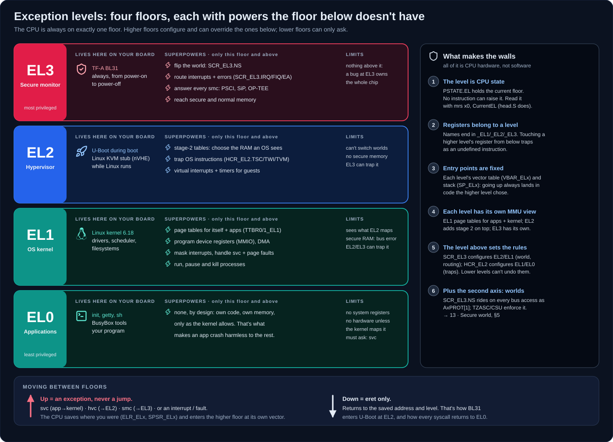
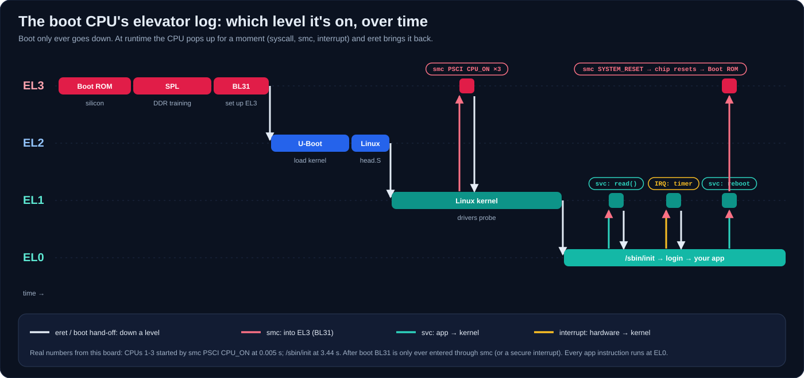

# 13 · The secure world: TF-A, OP-TEE and TrustZone

[Docs](README.md) › **13 · Secure world**

> **In this guide:** what "ATF", "BL31", "BL32", "BL33" and "OP-TEE" really
> are; how the CPU's privilege levels and the two worlds fit together; what an
> `smc` does; how the hardware enforces TrustZone; and what is (and isn't)
> protected in this build. Every claim is backed by this repository's sources
> or a real boot log.

**Contents:** [The names](#1-the-names-untangled) ·
[Exception levels](#2-who-runs-where-exception-levels-and-worlds) ·
[Boot hand-offs](#3-the-boot-hand-offs-who-loads-what) ·
[What an smc does](#4-what-an-smc-does) ·
[How TrustZone is enforced](#5-how-trustzone-is-enforced) ·
[What this build protects](#6-what-this-build-protects-and-what-it-doesnt) ·
[Adding OP-TEE](#7-adding-op-tee-roadmap) · [See it on the board](#8-see-it-on-your-board)

---

## 1. The names, untangled

| Name | What it actually is | In this repo |
| --- | --- | --- |
| **ATF** | old name for **TF-A**, Trusted Firmware-A, Arm's reference secure firmware | `varigit/imx-atf` |
| **BL31** | TF-A's *runtime* stage: the **secure monitor**, running at EL3 | `build/src/imx-atf/build/imx8mp/release/bl31.bin` |
| **BL32** | the slot for a *secure payload*, usually **OP-TEE**, a trusted OS at S-EL1 | **not built** (optional) |
| **BL33** | the *non-secure* bootloader that BL31 hands off to: **U-Boot proper** | `u-boot-nodtb.bin` |
| BL1 / BL2 | TF-A's early stages. **Not used on i.MX**: the Boot ROM plays BL1, U-Boot SPL plays BL2 | – |
| **OP-TEE** | an open-source Trusted Execution Environment OS that runs Trusted Applications (TAs) | optional |
| **SPL** | U-Boot's tiny first stage: trains DDR, loads the FIT | `spl/u-boot-spl.bin` |

> **EL** = *exception level*, the CPU privilege level (EL0 apps … EL3 secure
> monitor). What separates them and what each can do: [§2](#2-who-runs-where-exception-levels-and-worlds).
>
> **"BL" numbers are boot-stage names, not privilege levels.** BL31 happens to
> run at EL3 and BL33 at EL2, but "BL32" doesn't mean "EL3-2". They are just
> labels from the TF-A architecture.

In one sentence each:

- **TF-A BL31** is the *secure monitor*. It is the only code at EL3, it owns
  the switch between worlds, and it stays resident forever, answering `smc` calls.
- **OP-TEE (BL32)** is the *secure operating system*. It runs trusted
  applications next to Linux, in memory Linux cannot touch.
- **U-Boot (BL33)** is the *normal-world bootloader*. It loads Linux and is
  gone afterwards.

## 2. Who runs where: exception levels and worlds

### 2.1 The idea in one picture

Think of the CPU as a building with **four floors**. Whoever is on a higher
floor holds keys that the floors below don't have: they set the rules for the
floors below and can step in when something goes wrong. The CPU is always on
exactly one floor, and there are no stairs, only two kinds of lift:
**exceptions** take you up, and **`eret`** takes you down.



Why have four at all? Each floor protects the one below it from the one below
*that*:

| Level | Name | Protects… | …from | On your board |
| --- | --- | --- | --- | --- |
| **EL0** | application | – | – | `init`, `sh`, your program |
| **EL1** | OS kernel | each app and the kernel | other apps | Linux kernel |
| **EL2** | hypervisor | each OS | other OSes (virtual machines) | U-Boot at boot; Linux's KVM stub |
| **EL3** | secure monitor | the secure world and the chip's security settings | every OS, including a compromised one | TF-A BL31 |

### 2.2 What actually separates them

Nothing here is a software convention. These are rules built into the
Cortex-A53, and code on a lower level cannot get around them:

| # | Mechanism | What it means in practice |
| --- | --- | --- |
| 1 | **The current level is CPU state** (`PSTATE.EL`) | No instruction sets it. The kernel's first instructions just *read* it: `mrs x1, CurrentEL; cmp x1, #CurrentEL_EL2` (`arch/arm64/kernel/head.S`) |
| 2 | **System registers belong to a level** | `SCTLR_EL1`, `HCR_EL2`, `SCR_EL3` …: the suffix is the lowest level allowed to touch it. EL1 writing `SCR_EL3` gets an *undefined instruction* exception, not a write |
| 3 | **Entry points are fixed by the higher level** | Each level has its own vector table (`VBAR_ELx`) and stack (`SP_ELx`). You can't pick where you land when you go up; the higher level already decided |
| 4 | **Each level has its own view of memory** | EL1's page tables (`TTBR0/1_EL1`) map the kernel and apps. EL2 can add a **second stage** (`VTTBR_EL2`) on top, so an OS only sees RAM the hypervisor gives it. EL3 has its own tables |
| 5 | **The level above configures the one below** | `SCR_EL3` (set by BL31) decides the world and where interrupts go. `HCR_EL2` decides which EL1 actions trap to EL2 (`TSC`: trap `smc`, `TWI`: trap `wfi`, `VM`: enable stage 2 …) |
| 6 | **Interrupts and errors are routed upward** | the higher level chooses which level handles IRQ, FIQ and external aborts, so a lower level can't hide from them |

### 2.3 The superpowers of each level

| Level | Can do that the levels below can't | Real example on this board |
| --- | --- | --- |
| **EL3** | switch worlds (`SCR_EL3.NS`); route interrupts/errors; answer every `smc`; access secure *and* normal memory | TF-A sets `scr_el3 \|= SCR_NS_BIT` when it builds the normal-world context (`lib/el3_runtime/aarch64/context_mgmt.c`), then `eret`s into U-Boot |
| **EL2** | second-stage page tables; trap and emulate an OS's instructions; virtual interrupts and timers | U-Boot runs here during boot; Linux installs its KVM stub: `kvm [1]: Hyp nVHE mode initialized successfully` |
| **EL1** | page tables for every process; device registers; masking interrupts; handling faults and syscalls | the kernel maps `/dev/rtc0`'s chip, schedules `sh`, kills a process that touches bad memory |
| **EL0** | nothing extra, which is the point: a crash or bug only hurts that one process | `ls`, `top`, your app |

And the costs that come with the power:

- **A bug at EL3 is a bug in the whole chip's security.** That's why BL31 is
  small (43 KiB here), audited, and pinned to an exact commit.
- **EL2 is invisible until used.** On this board nothing runs virtual
  machines, so EL2 holds only the stub, but it *could* host KVM guests.
- **EL1 is trusted by every app on the system,** so a kernel driver bug can
  crash everything. EL0 code can't.

### 2.4 Moving between levels



| Direction | How | Who uses it here |
| --- | --- | --- |
| **up** to EL1 | `svc #0` (system call), or an interrupt/fault | every `open`, `read`, `ioctl`; timer ticks; page faults |
| **up** to EL2 | `hvc #0` | KVM; not in normal use on this image |
| **up** to EL3 | `smc #0` | PSCI: CPU_ON for CPUs 1–3 at boot, `reboot`, `poweroff`; NXP SiP calls |
| **down** | `eret` | BL31 → U-Boot (EL2) at boot; Linux EL2 → EL1 in `head.S`; every syscall returning to EL0 |

On the way up the CPU saves where you were (`ELR_ELx`) and the previous
state (`SPSR_ELx`). `eret` restores exactly that. This is why a lower level
can't fake its way up: it can only *request* an entry, at a door the higher
level built.

### 2.5 Levels vs. worlds: two different axes

"Level" (EL0–EL3) and "world" (secure / normal) are **independent**:

| | Secure world | Normal world |
| --- | --- | --- |
| EL3 | TF-A BL31 (EL3 belongs to neither world; it is the gate between them) | ← same |
| EL2 | *(no S-EL2 on Armv8.0)* | U-Boot during boot · Linux's KVM stub at runtime |
| EL1 | OP-TEE OS *(if built)* | Linux kernel |
| EL0 | Trusted Applications *(if built)* | your applications |


- The **level** limits what *code* may do on the CPU.
- The **world** limits what *memory and devices* that code can reach, and it
  is enforced on the bus (§5).
- So OP-TEE at S-EL1 is "only" EL1, yet it can read secure RAM that the
  Linux kernel, also EL1, can never see.

### 2.6 Myths worth unlearning

1. **"EL3 is the same as BL31."** No: EL3 is a CPU *level*, and BL31 is the
   *firmware* that happens to run there. The Boot ROM and SPL also run at EL3,
   before BL31 exists.
2. **"BL33 means EL3-something."** No: BL numbers are boot stages
   (see [§1](#1-the-names-untangled)). BL33 (U-Boot) runs at EL2.
3. **"root can do anything."** Root is a Linux idea at EL0/EL1. It can't
   switch worlds, read secure memory, or change BL31's settings.
4. **"The kernel runs at EL1, so it starts there."** On this board it
   *enters at EL2*: `CPU: All CPU(s) started at EL2`. It keeps a KVM stub at
   EL2 and drops itself to EL1 with `eret`.
5. **"Apps can call the secure world."** Only EL1 and above can execute
   `smc`. An app asks the kernel (`ioctl`), and the kernel's driver issues
   the `smc`.
6. **"U-Boot is still around."** After `booti` it is gone. BL31 (and OP-TEE,
   if present) are the only firmware left running.

## 3. The boot hand-offs: who loads what


The exact sequence on the i.MX8MP:

| # | Who | Does | Then |
| --- | --- | --- | --- |
| 1 | **Boot ROM** (EL3, secure) | reads `imx-boot.bin` at 32 KiB, copies the SPL (+ DDR firmware) into OCRAM `0x920000` | jumps to SPL |
| 2 | **SPL** (EL3, secure) | trains LPDDR4, reads the FIT: **BL31 → OCRAM `0x970000`**, **U-Boot + DTB → DDR `0x40200000`**, *(OP-TEE → `0x56000000`)* | jumps to BL31 |
| 3 | **BL31** (EL3) | sets up the secure monitor, TZASC/CSU/RDC. *If a BL32 exists:* ERETs into OP-TEE at S-EL1, which initialises and returns to BL31 | ERETs to BL33 at **EL2, non-secure** |
| 4 | **U-Boot** (EL2, NS) | loads Image.gz + DTB, `booti` | gone |
| 5 | **Linux** (EL2 → EL1) | starts CPUs 1–3 via PSCI `smc` → BL31 | runs |

> **BL31 does not load OP-TEE.** The SPL copies *all* images out of the FIT.
> BL31 only *starts* OP-TEE (through its "secure payload dispatcher", `SPD=opteed`)
> before handing off to U-Boot.

## 4. What an smc does


`smc #0` (Secure Monitor Call) is a **deliberate, synchronous exception**, not
an error. The CPU saves the return address in `ELR_EL3` and the state in
`SPSR_EL3`, then jumps to BL31's exception vector. BL31 reads the **function
ID in `x0`**, which follows Arm's SMC Calling Convention (SMCCC; this firmware
implements v1.5):

| `x0` range | Owner | Handled by | Examples on this board |
| --- | --- | --- | --- |
| `0x84xx_xxxx` / `0xC4xx_xxxx` | **PSCI** (standard service) | BL31 itself | `0xC400_0003` CPU_ON (starts CPUs 1–3 at boot), `0x8400_0009` SYSTEM_RESET (`reboot`), `0x8400_0008` SYSTEM_OFF |
| `0xC2xx_xxxx` | **SiP**: NXP-specific | BL31 itself | `0xC200_0004` DDR frequency scaling, `0xC200_0001` CPU frequency, `0xC200_0000` power domains (GPC), `0xC200_0002` RTC/watchdog |
| `0x32xx_xxxx` / `0xB2xx_xxxx` | **Trusted OS** | forwarded to OP-TEE | `0x3200_0004` CALL_WITH_ARG *(only with OP-TEE)* |

BL31 answers PSCI and SiP calls itself and returns with `eret`, results in
`x0`–`x3`. For a Trusted-OS call it saves the whole normal-world register
context, flips `SCR_EL3.NS` to 0, and enters OP-TEE. On the way back it restores
Linux's context. Linux never sees secure memory or secure registers.

## 5. How TrustZone is enforced


TrustZone is **hardware**:

1. The CPU's world is one bit, `SCR_EL3.NS`, and **only EL3 can change it**.
2. Every bus transaction carries that bit as **`AxPROT[1]`**.
3. Checkers sit between the bus and the resources:
   - **TZASC (TZC-380)** in front of DDR: up to 16 regions, each with secure /
     non-secure read/write permissions.
   - **CSU** per peripheral (CAAM, SNVS, UARTs …), and **RDC** per bus master
     (A53 cluster, Cortex-M7, DMA engines).
4. A denied access gets a **bus error**: the CPU takes an abort. Being root, or
   running kernel code, doesn't matter; the bus refuses.

## 6. What this build protects, and what it doesn't

Read straight from the code this repository builds:

| Where | Code | Effect |
| --- | --- | --- |
| SPL | `board/variscite/imx8mp_var_dart/spl.c` → `enable_tzc380()` | TZASC **enabled and locked**, region 0 = **all DDR, secure + non-secure RW** |
| BL31 | `imx8mp_bl31_setup.c` → `bl31_tzc380_setup()` | programs the same open region 0 |
| BL31 | `bl31_early_platform_setup2()` → CSU `0x00ff00ff` × 64 | **every peripheral** accessible from both worlds |

So in this build:

- ✅ **BL31 is isolated** in on-chip RAM and is the only code at EL3.
- ✅ **PSCI/SiP** go through a narrow, well-defined interface.
- ❌ **No DDR region is secure-only.** There is nothing secret to protect yet.
- ❌ **No secure boot.** The HAB signature slot in `imx-boot.bin` is empty, so
  anyone with the SD card can replace any stage.

That is the normal starting point for development. To actually *protect*
something (keys, credentials), you need **both**:

1. **OP-TEE**, which adds a secure-only TZASC region and a place to run code
   on secrets, and
2. **HAB secure boot**: signed `imx-boot.bin` and fused keys, so the firmware
   that sets up the protection can't be swapped.

## 7. Adding OP-TEE: roadmap

Not automated in this repository yet. These are the moving parts, matching
what NXP's and Variscite's Yocto layers do when `MACHINE_FEATURES` contains `optee`:

| Step | Component | Change |
| --- | --- | --- |
| 1 | **OP-TEE OS** | build `nxp-imx/imx-optee-os` @ `lf-6.18.20_2.0.0` with `PLATFORM=imx-mx8mpevk CFG_DDR_SIZE=0x100000000` → `tee.bin` (Variscite's layer adds only `CFG_DDR_SIZE` for the 8M Plus) |
| 2 | **TF-A** | rebuild BL31 with `SPD=opteed`, so BL31 dispatches Trusted-OS calls and starts BL32 at `BL32_BASE = 0x56000000` |
| 3 | **imx-mkimage** | put `tee.bin` in `iMX8M/`. `mkimage_fit_atf.sh` adds a `tee-1` image to the FIT, loaded at `TEE_LOAD_ADDR = 0x56000000` |
| 4 | **U-Boot** | detects OP-TEE and adds the `/firmware/optee` node and a reserved-memory region to the kernel's device tree |
| 5 | **Linux** | `CONFIG_OPTEE=y`: the driver appears as `/dev/tee0` and `/dev/teepriv0` |
| 6 | **Userspace** | `optee-client` (`tee-supplicant`, `libteec`), and your Trusted Applications built with the OP-TEE TA dev kit |

Afterwards the `optee` line in the U-Boot log changes from
`OP-TEE api uid mismatch` to a version banner, and the kernel prints
`optee: initialized driver`.

## 8. See it on your board

```sh
# PSCI conduit and version the kernel negotiated with BL31
dmesg | grep -iE "psci|SMC Calling"
cat /sys/firmware/devicetree/base/psci/compatible; echo     # arm,psci-1.0
cat /sys/firmware/devicetree/base/psci/method; echo         # smc

# The kernel entered at EL2 and kept a KVM stub there
dmesg | grep -E "started at EL|Hyp"

# No OP-TEE: no firmware node, no /dev/tee*
ls /sys/firmware/devicetree/base/firmware 2>/dev/null; ls /dev/tee* 2>/dev/null

# Every reboot / poweroff is an smc to BL31 (PSCI SYSTEM_RESET / SYSTEM_OFF)
reboot
```

Real output from the VAR-SOM-MX8M-PLUS used for these docs:

```text
psci: probing for conduit method from DT.
psci: PSCIv1.1 detected in firmware.
psci: Using standard PSCI v0.2 function IDs
psci: SMC Calling Convention v1.5
CPU: All CPU(s) started at EL2
kvm [1]: Hyp nVHE mode initialized successfully
arm,psci-1.0
smc
```

---

← [12 · Board tour](12-board-tour.md) · [Index](README.md) · [14 · Acronyms](14-acronyms.md) →
